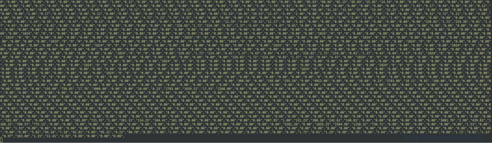
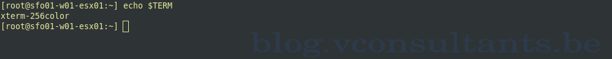
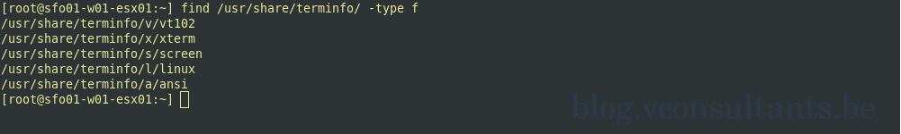
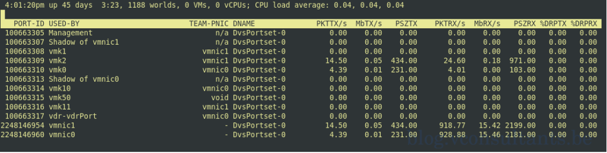

When you connect to your ESXi host and you launch esxtop. You look at the esxtop output and it is not displaying as it should. Instead, it is displaying like in the below screenshot:


Your esxtop output will be displayed correctly if you are using a terminal emulator that defaults to xterm as the TERM environment variable. Some terminal emulators will use another terminal emulator value by default, eg. xterm-256color. ESXi does not map xterm-256color to one of the values it knows, so it doesn't know how to display the output.

There is a KB article that explains how to resolve:

[VMware KB Output of esxtop defaults to non-interactive CSV with unknown TermInfo (2001448)](https://kb.vmware.com/s/article/2001448)

The value of the environment variable TERM is used by the server to control how input is recognized by the system, and what capabilities exist for output.

Let us have a look first what the TERM variable is in my case:

```shell
echo $TERM
```

I am receiving the following output:


My terminal emulator tries to connect to the endpoint (ESXi) with xterm-256color. Now let's take a look at what values this endpoint does support:


So all of the above is possible to assign to TERM. The value my terminal emulator uses is not among the supported terminfo types. So the ESXi host cannot map to any of the known and thus does not know how to display the esxtop info correctly.

When we update the TERM environment variable to xterm and try to run esxtop again, the output will show nicely formatted.

```shell
TERM=xterm
echo $TERM
```

Let's check esxtop again to make sure the outcome is as expected:
